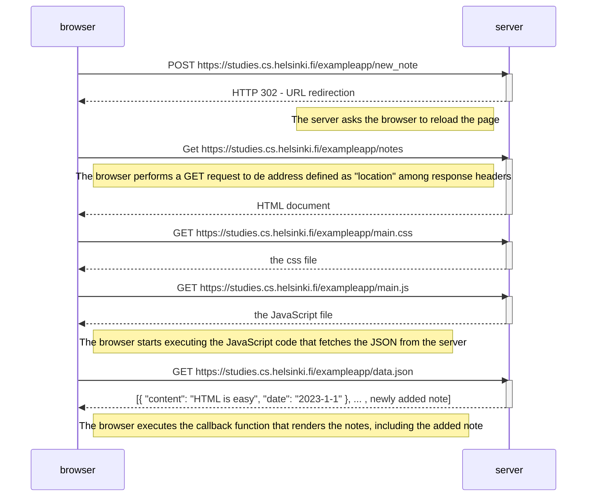

```mermaid
sequenceDiagram
    participant browser
    participant server
    
    browser->>server: POST https://studies.cs.helsinki.fi/exampleapp/new_note 
    activate server
    server-->>browser:HTTP 302 - URL redirection
    deactivate server

    Note left of server: The server asks the browser to reload the page

    browser->>server: Get https://studies.cs.helsinki.fi/exampleapp/notes
    activate server
    Note right of browser: The browser performs a GET request to de address defined as "location" among response headers
    server-->>browser:HTML document
    deactivate server

    browser->>server: GET https://studies.cs.helsinki.fi/exampleapp/main.css
    activate server
    server-->>browser: the css file
    deactivate server

    browser->>server: GET https://studies.cs.helsinki.fi/exampleapp/main.js
    activate server
    server-->>browser: the JavaScript file
    deactivate server

    Note right of browser: The browser starts executing the JavaScript code that fetches the JSON from the server

    browser->>server: GET https://studies.cs.helsinki.fi/exampleapp/data.json
    activate server
    server-->>browser: [{ "content": "HTML is easy", "date": "2023-1-1" }, ... , newly added note]
    deactivate server

    Note right of browser: The browser executes the callback function that renders the notes, including the added note
```