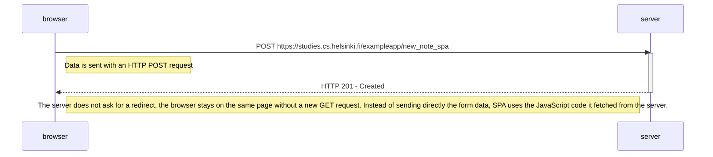

```mermaid
sequenceDiagram
    participant browser
    participant server

    browser->>server: POST https://studies.cs.helsinki.fi/exampleapp/new_note_spa
    activate server
    Note right of browser: Data is sent with an HTTP POST request 
    server-->>browser: HTTP 201 - Created
    deactivate server
    Note left of server:The server does not ask for a redirect, the browser stays on the same page without a new GET request. Instead of sending directly the form data, SPA uses the JavaScript code it fetched from the server. 
```